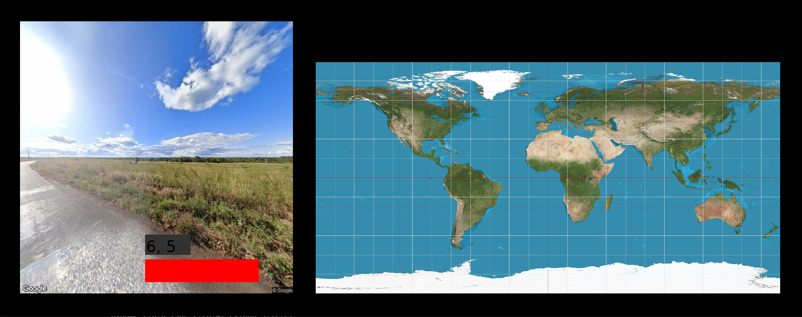

# 🌏 Geoguessr 🌏

This is a python-based remake of Geoguessr aimed at educating users on geography in an immersing way. Learn more about different countries and cultures and take inspiration for your real-life travels!

## Overview

This game recreates the Geoguessr experience with:
* 10k Google Street View images across all 7 continents
* A point system based on gaussian distributions
* Latitude and longitude conversions with haversine functions
* A visualization of your guess and answer on a world map


## Set-Up

1. Clone the repository by running the following command in the terminal:

    ```
    git clone git@github.com:olincollege/geoguessr.git
    ```

2. Navigate into the directory:

    ```
    cd geoguessr/
    ```

3. Install the required dependencies:

    ```
    pip install requirements.txt
    ```

4. Download the Kaggle dataset from the link `https://www.kaggle.com/datasets/paulchambaz/google-street-view?resource=download`. Extract the zip file, move the `dataset` folder into the root of this repository, then run:

    ```
    mkdir -p dataset/images && mv dataset/*.png dataset/images/
    ```    

## Let's Play
Run the game with ```main.py```. 


Click on the gray box to input your guess latitude and longitude (ex. -30.2 40.5).


Click on the blue button to submit your guess.


Then click on the green button to move on to the next round.

***Note that the button turns red if your input is not in the right format as seen below:***

 
## Testing
Test our game function and logic by running `pytest` at the root of the repository.

## Contributors
The contributors for this project are Esther Aduamah and Irene Hong. Geoguessr was a culminating project for our Intro to Python course to demonstrate our implementation of an MVC architecture with an interactive activity. 

***DISCLAIMER: This is project is not affiliated or endorsed by Gemini. We do not take ownership of any assets from the original Geoguessr game.***
