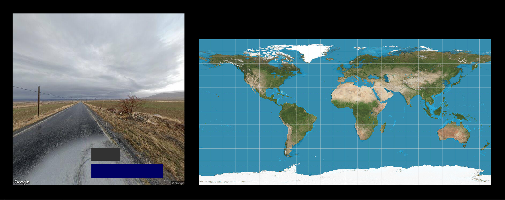
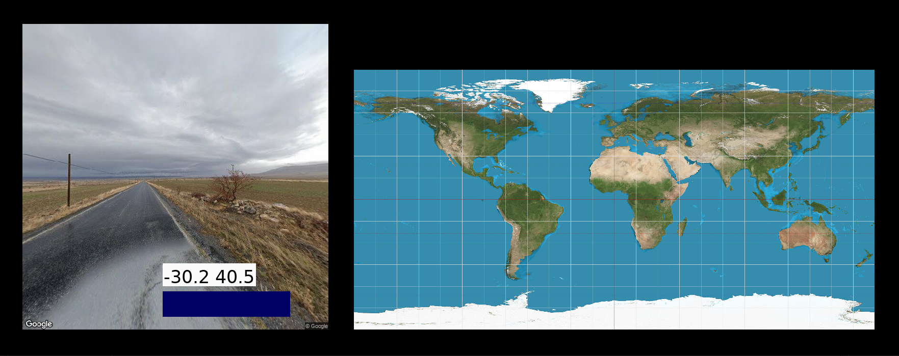
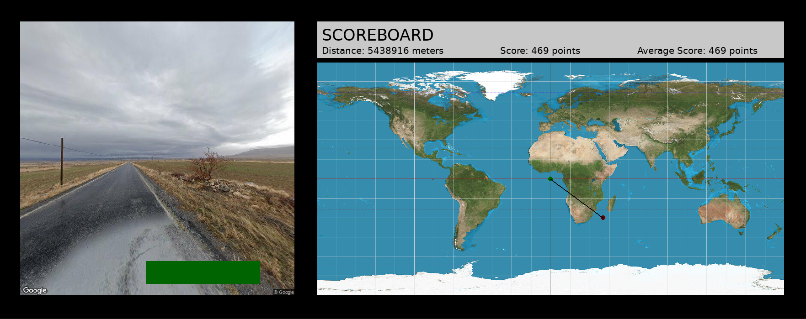
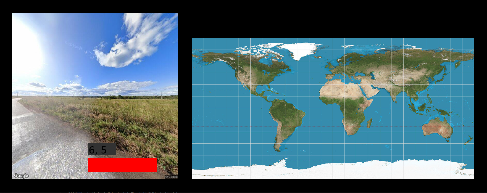

# Welcome to Geoguessr Lite! 
 
Welcome to Geoguessr Lite! You will be dropped into a random location in the world and must deduce where you are based on unique observations like key landmarks, license plates, native grass species, road widths, sun positions, and basically anything else that you can possibly think of. 

With this addicting competitive game, we aim to provide an educational platform for users on the different cultures and countries that exist around the world. By visiting all 7 continents online with the touch of a button, we hope to inspire curious users to pursue an adventure to a new place in real life.

## Overview

This game recreates the Geoguessr experience with:
* 10k Google Street View images across all 7 continents
* A point system based on gaussian distributions
* Latitude and longitude conversions with haversine functions
* A visualization of your guess and answer on a world map
  
***Now let's explore the world!***

## Game Controls

Click on the gray box to input your guess latitude and longitude (ex. -30.2 40.5).

Click on the blue button to submit your guess.

Look at your running stats on the scoreboard and compare your guess with the answer on the map! Then, click on the green button to move on to the next round.

***Note that the button turns red if your input is not in the right format as seen below:***

## Demo

## Do you want to download Geoguessr Lite for yourself?
1. To play the game yourself, clone our [repository](https://github.com/olincollege/geoguessr): https://github.com/olincollege/geoguessr 

    **AND** 

2. Follow the instructions in our README. It will tell you everything you need to know about our game!
   
   
## Authors 

> Esther Aduamah is a Biomedical Engineering major at Olin College of Engineering in the class of 2027. 
> Irene Hong is an Electrical and Computer Engineering major at Olin College of Engineering in the class of 2028.

## Attributions

> Kaggle was used to source a 10k Google Street View image dataset created under Paul Chambaz.

> Pygame was used to create widgets and the user interface.

> ChatGPT was used for aid with debugging. 
   
